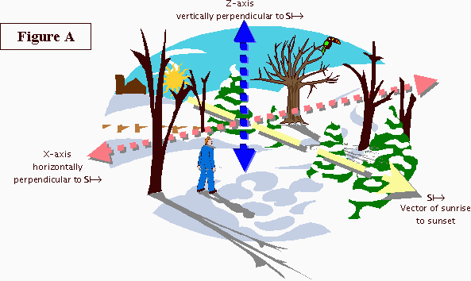
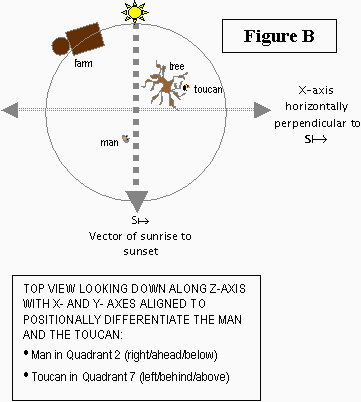
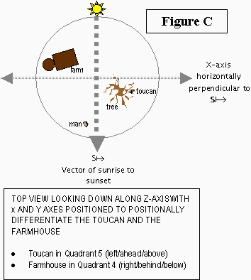
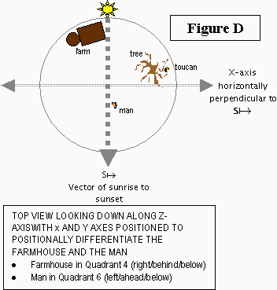

这篇文章是基于 Ithkuil 2011 语法文档修改以适应 New Ithkuil 的情况所作的。来源于第 9 章 Syntax 及第 10 章 Lexico-Semantics。

## 话题与焦点、句法关系

讨论句法前有必要粗略了解一下这些概念：

* 语义角色：指词语的基本语义功能，不论其具体构词范畴。例如 New Ithkuil 的格，反映的是语义角色。
* 语用角色：指词语相对于谓语或句子其余部分的功能，即关于其是否及如何代表「已知」或「新」的信息。这些角色通常有三种：话题、评论、焦点。
* 句法关系：指词序规则，不论具体语义或语用角色。

任何一门语言的句法：(1)确立其合法的句法关系，或(2)反映/强化语义角色，或(3)反映/强化语用角色，或(4)以上任何组合。例如英语的句子通常主语在动词前，直接宾语在动词后。它的句法偏重确立句法关系，几乎不反映语义角色，也很少反映语用角色（一个例外是特殊疑问词几乎总是位于句首），不过这些角色倒是常常会用「超音段」的方法，即音高、语调的变化来表示。

我们已经知道 New Ithkuil 是如何使用众多的格在构词上反映语义角色。既然句法关系是一门语言任意决定的，New Ithkuil 的词序便主要用于反映语用角色，即句子的话题/焦点。此外也有一些必要的词序限制以避免歧义。

### 1 话题与焦点

在具体语境的系列话语（如一个对话，一个故事，一个事件讲述等）中，任何单个句子都可能会引用提到过的对象作为背景，也可能会引入新的对象以进一步论述。其中已知或暗示的背景，即受话者请求或期待过将要提及的词语是**话题**，发话者关于具体话题给出的信息（通常是谓语）是**评论**，句中任何受话者之前未知的新信息是**焦点**。

比如，对于提问「我知道玛丽为什么生气，那比尔呢？」(即，什么事让比尔也生气？)，假如回答是「比尔/他生气是因为他丢了钥匙」，那么[比尔/他]是话题，[生气是因为他丢了钥匙]是评论，[他丢了钥匙]是焦点。

再如，「我的狗会钻铁环」可以是几种提问的回答：(1)你的狗会什么？ (2)你的狗能对铁环做什么？ (3)谁的狗会钻铁环？ 甚至是(4)你咋了？——

如回答问题1，则[钻铁环]是焦点，狗是已知背景即话题。回答问题2，[钻]是焦点，狗和铁环都是话题。回答问题3，[我的]是焦点，狗钻铁环是话题。最后回答问题4，由于说的都是对话背景中未预期的内容，没哪个词是话题，哪个词都可以说是焦点，也就等于没焦点。

焦点不一定需要有完整的对话。比如，一个人可能会用「我的狗会钻铁环」开始一场对话，並用语调或音高强调焦点。或者用中性的语调，让受话者自行选择焦点，作为话题来回答，比如：「哦，你有狗？」，或「噢，它还会别的吗？」，或「呃，铁环有多大？」，或同样中性的「啊，是吗？」

### 2 话题与焦点的表示

New Ithkuil 使用词序完成同样的选择：话题置于句首，焦点直接置于动词前。如无明显的话题或焦点，则动词位于句首。例如：

    <dl class="gloss">
      <dt>Hlerdvöé-wetxawá</dt>
      <dd>T1​-S2​-“purchasing​/buying”​-PCR​—S2​-“eating food”​-RTR​-OBS</dd>
    </dl>
    <dl class="gloss">
      <dt>kšilu</dt>
      <dd>S1​-“performing as a clown”​-OBJ​-IND</dd>
    </dl>
    <dl class="gloss">
      <dt>waiţpra.</dt>
      <dd>S1.G​-“clam”</dd>
    </dl>
    
<q>The clown bought some clams and consumed them.</q>

    
小丑买了些蛤吃（无话题焦点）

    <dl class="gloss">
      <dt>Kšilu</dt>
    </dl>
    <dl class="gloss">
      <dt>hlerdvöé-wetxawá</dt>
    </dl>
    <dl class="gloss">
      <dt>waiţpra.</dt>
    </dl>
    
<q>It was the clown who bought some clams and consumed them.</q>

    
是小丑买了些蛤吃（小丑是焦点）

    <dl class="gloss">
      <dt>Waiţpra</dt>
    </dl>
    <dl class="gloss">
      <dt>kšilu</dt>
    </dl>
    <dl class="gloss">
      <dt>hlerdvöé-wetxawá.</dt>
    </dl>
    
<q>As for the clams, it was the clown who bought and consumed them.</q>

    
那些蛤么，是小丑买了吃。（蛤是话题，小丑是焦点）

### 3 焦点与话题化省略句

和其他语言一样，New Ithkuil 能使用省略句回答关于已知话题的命令、提问或评论。

* 因话题是对话背景中的已知部分，故新的句子只需说焦点。
* 话题化词缀 -ëin (-Vn/5) 与询问语为连用，构成已知背景内的省略提问，像「比尔呢？」代替完整的句子「告诉我这件事对于比尔又是怎样。」

### 4 格框内的话题与焦点

格框内的动词总是位于格框之首。因此有必要使用词缀 -n 来说明格框内哪些成分带焦点或被话题化。格框的最后一个名词用词缀 -n 的程度1/2/6/7/8来指明格框结尾，除非格框本身已在句子结尾。

### 5 额外的词序限制

以下额外的词序限制是为避免歧义或语义不连贯。

* 使用邻置格/关联格/连属格的名词，如从属于另一个名词或与它形成同位语，则必须与它相邻（在前或后），除非它们的关系已通过上下文或其他构词手段清楚显示（如使用格辖或联对/链）。
* 一个格框应是完整连贯的，即不能断开来插入任何主句的成份。不过，格框内可以嵌入次级格框，如：\[尽管拥有\[来自他的蓝色时期的\]\[，我\[，一个普通学生，\]喜欢的\]一幅毕加索名作\]，乔其实是个很谦虚的人。

### 6 基于音位规则的句法调整

词序可以调整以适应音位或语音美学效果，即听着顺耳。因为六个以上音节的词往往不太方便，所以一个包含太多词缀的构形词可以把一些元素（词缀、时体和其他模范畴、格辖、语式等）转移到小词中去，或变成独立的小词（见语法文档[第 8 章](../docs/08)）。

    <dl class="gloss">
      <dt>Wetxëimčëiřḑiríu</dt>
      <dd>S2​-“eating food”​-AP2​/5₁​-EXT​/5₁​-NEG​/4₁​-HOR</dd>
    </dl>
    <dl class="gloss">
      <dt>eřdmilu.</dt>
      <dd>S2​-“physician​/medical doctor”​-OBJ​-IND</dd>
    </dl>
     
    <dl class="gloss">
      <dt>→</dt>
    </dl>
    <dl class="gloss">
      <dt>Ri’hlëimčëiřḑi</dt>
      <dd>NEG​/4₁​-{VIIDom}​-AP2​/5₁​-EXT​/5₁​-{VIISub}</dd>
    </dl>
    <dl class="gloss">
      <dt>wetxíu</dt>
      <dd>S2​-“eating food”​-HOR</dd>
    </dl>
    <dl class="gloss">
      <dt>eřdmilu.</dt>
      <dd>S2​-“physician​/medical doctor”​-OBJ​-IND</dd>
    </dl>
    
<q>If only the physician wouldn’t eat his food in one gulp like that.</q>

    
那医生别那样一个劲的吃才好。

应确保这些小词的位置便于与其对应的构形词联系。这往往意味着要与构形词或其他对应构形词的小词相邻。

### 7 象似性

一般语言往往有一些短语结构或词序样式，用来反映或强化一种说明描述对象的认知上的理解，即词序本身告诉我们应该怎样去理解话语。这种现象被称为「<tooltip label="iconicity">象似性</tooltip>」。最常见的是所谓的「次序象似性」，即词语顺序反映所述事件次序。像：「看一看，试一试，买一买」，「我来到，我看到，我征服」，「dine and dash」，描述的都是次序性事件，词语顺序反映事件次序。更改这些词序要么会导致无意义，要么会改变话语意义。以下例子颇有代表性：

(1) Jane结了婚，有了孩子。
(2) Jane有了孩子，结了婚。

这是由于语言中的连词(或省略连词的句子並列)常常有歧义，即不仅表示简单的並列描述，还可以理解为有次序关系，导致两个不同句子使人们对Jane的社会形象有不同诠释。

此外还有其他词序象似性。看以下例子：

(3) Sam painted the fence white.
(4) Sam painted the white fence.

对于前一句，我们不知道染色之前栅栏是什么颜色。对于后一句，我们不知道染完色后栅栏是什么颜色。这种象似性是形式上把形容词在名词前的一般词序颠倒，以区分事物的原来状态和结果状态。

还有一种：

(5) Loretta给了Sue一件结婚礼物。
(6) Loretta把一件结婚礼物给了Sue。

大多语法教科书会说这两个句子在语义上是等价的，只是语法形式不同而已。然而两句话是有微妙语义区别的。第一句强调礼物是给Sue的，即Sue是新娘，是预期的领受者。而第二句带有一种可能，即Sue只是暂时或描述性的给予行为的接收者，比如Sue只是出席婚礼的客人，Loretta需要她帮忙搬一堆结婚礼物。这种把预期领受者跟描述性接收者区分开来的象似性是所谓「距离象似性」的一个例子，就是说，两个词距离拉近一点，反映其联系有较多内涵，拉远一点，反映其联系较属表面现象。

New Ithkuil 没有象似性。虽然它的词序可能会碰巧反映临时或原因性的事件次序，但这与句法设计无关。它已有多种手段在构词上区分次序、因果、结果状态、领受者与临时接收者，因此不需要象似性。

New Ithkuil 用各种词缀（见词缀文档章节关于 Sequential/Temporal Affixes 及 Coordinative and Connective Affixes）非常具体地表达不同的並列和次序样式：有表示简单列举的「及」（梨和苹果和香蕉），有表示同时性的「並」（我握紧拳头並怒视），有表示附加信息的「且」（小丑喜欢孩子，且喜欢吃东西），有表示平行描述或活动的「而」（我们去跳舞，而他们也去）, 还有表示描述性次序的「並」（我去窗口並向外看）。

## 形态语义上的考虑

用 New Ithkuil 造句，尤其从其他语言翻译过来时，要注意避免带入源语言构词上反映的不相关语义信息或试图在 New Ithkuil 找等价的表达法。这样有可能会影响造出的 New Ithkuil 句子的形态句法结构。

### 1 任意视角描述

有些语言里，词语选择会任意地影响句子结构的一个表现是个别视角的无意图式化，例如：

1. 出峡谷的路挺陡。
2. 下峡谷的路挺陡。

两句描述的都是路的同一属性：陡。区别来自发话者的视角。句(1)暗示的视角是从谷底向上，句(2)的是从谷顶向下。关键是语义上来说，视角本身和路的陡没什么关系。所以如果话语的认知意图只是描述峡谷内的垂直路径的陡度，两句话在 New Ithkuil 里只会有同一种表达，完全撇开视角，将句子改述为：

    <dl class="gloss">
      <dt>Öga</dt>
      <dd>EXN/6₁</dd>
    </dl>
    <dl class="gloss">
      <dt>krudmá</dt>
      <dd>S1-“ascending descending at a slant”-DYN-PRX.N.RPV-OBS</dd>
    </dl>
    <dl class="gloss">
      <dt>wavňë’ifçu’a.</dt>
      <dd>S1-“valley”-DSZ/5₁-{Ca}-NAV</dd>
    </dl>
    
<q>The path through the canyon is steep.</q>

    
走峡谷的路（想象中）挺陡 / 峡谷之道似甚陡 [未必有人走在峡谷里（包括发话者），故「陡」仅作为说话者脑海中的一个猜测而存在]

### 2 语义或参与性角色的隐蔽

类似，须注意 New Ithkuil 的语法允许具体句子中的隐含语义角色反映得更明显。于是西方语言中会「遮蔽」反常语义结构的句子结构在 New Ithkuil 得到避免，例如：

(3a) He supplied a report to the analyst.
(4a) She applied a solvent to the stain.
(3b) He supplied the analyst a report.
(4b) *She applied the stain a solvent.

两组句子的句法样式相同，但(4b)词序不合法，(3b)同样的词序却没问题。这种区别的隐含原因在于语义角色。「分析师」能充当[领收者]的角色，「污渍」却不能（只是[方向性目标]，即溶剂应用处）。认知上，污渍不能像分析师「拥有」报告一样「拥有」溶剂。New Ithkuil 里，语义角色可用名词格标记明确定义，因此不会有(3b)(4b)这种句法不一致的句对。

有时不是语义角色，而是一个论元关联隐含从句的问题。例如 He’s a tall president 意思是「他是个身材高的总统」。那为什么 He’s a likely president 意思不是「*他是个有可能的总统」？因为“tall”是描述相邻的对象“president”，“likely” 却不描述相邻的对象，毋宁说是描述该对象正在或将要参与的某个过程，即「竞选总统」。因此这两句英语里句法构成一样的话译到 New Ithkuil 时句法构成会很不一样：

    <dl class="gloss">
      <dt>Mi</dt>
      <dd>ma-AFF</dd>
    </dl>
    <dl class="gloss">
      <dt>charţouvvá</dt>
      <dd>S1-“degree of height”-PTT/6₂-N-OBS</dd>
    </dl>
    <dl class="gloss">
      <dt>hruḑfiu-e’vkyiržuišmó’idde.</dt>
      <dd>T2​-S3​-“group of authorities recognized as a government”​-IDP​—S2​-“leader​/director”​-OBJ​-HRC​/9₂​-FRM​/7₂​-PRX​-COR\FRA</dd>
    </dl>
    
<q>He’s a tall president.</q>[literally: There is much height to him who is the official supreme leader of the government.]

    
身为总统的他体验到很多高度 = 他是个高总统 / 他，作为总统，身材高大。

    <dl class="gloss">
      <dt>Ma</dt>
      <dd>ma-THM</dd>
    </dl>
    <dl class="gloss">
      <dt>hruḑfiu-e’vkyiržuišmoiggórẓ.</dt>
      <dd>T2​-S3​-“group of authorities recognized as a government”​-IDP​—S2​-“leader​/director”​-OBJ​-HRC​/9₂​-FRM​/7₂​-ICP​-PRB​/7₁​-OBS</dd>
    </dl>
    
<q>He’s a likely president.</q>[literally: He is one who probably will begin to be the official supreme leader of the government.]

    
他很有可能会开始当总统 = 他很有可能当选总统

### 3 否定

另一个从其他语言译过来时较棘手的形态语义方面是否定。比如「雪莉不认为他们喜欢她做饭」。注意这句话不能逐字分析来理解成「雪莉没有在认为他们喜欢她做饭这件事」。真正意思是「雪莉认为他们不喜欢她做饭」。

New Ithkuil 里，控制否定词缀对构形词的管辖关系，可准确说明句中哪些成分被否定或肯定以及何种程度而无须调整句子结构，例如：

原句：我想继续唱歌 Ellyumčöjjalzá la’i.

* 我不想继续唱歌。Ire ellyumčöjjalzá la’i.
* 我想继续不唱歌。Iru ellyumčöjjalzá la’i.
* 我想不继续（不再）唱歌。Ira ellyumčöjjalzá la’i.

另外还有个西方语言里没有的形态语义区分：绝对否定和相对否定。前者表示实体/事态的不存在/无发生是由于语境性前提不可用，后者则表示不存在/无发生是处境性的。如：

    <dl class="gloss">
      <dt>Ellyurövvá</dt>
      <dd>S2-“singing a song”-DYN-NEG/6₁-N-OBS</dd>
    </dl>
    <dl class="gloss">
      <dt>wela’i.</dt>
      <dd>S2-“human child”-ACT</dd>
    </dl>
    
<q>The child doesn’t sing.</q>[because (s)he can’t, i.e., (s)he is mute].

    
孩子不能唱 [因他无法，比如他是哑巴]

    <dl class="gloss">
      <dt>Ellyurivvá</dt>
      <dd>S2-“singing a song”-DYN-NEG/4₁-N-OBS</dd>
    </dl>
    <dl class="gloss">
      <dt>wela’i.</dt>
      <dd>S2-“human child”-ACT</dd>
    </dl>
    
<q>The child doesn’t sing.</q> [even though (s)he can, i.e., (s)he chooses not to]

    
孩子不会唱 [能唱但选择不唱]

## 空间方位表达

New Ithkuil 的空间方位表达与西方语言很不同，主要有三点：

::: tabs

@tab (1)

New Ithkuil 不用介词，所有空间关系都用构形词（动词或名词）表示。

@tab (2)

西方语言的空间关系描述可以带有别的意图，New Ithkuil 的空间关系描述则纯粹为了提供空间关系信息。

比如问「比利在哪？」英语人的回答可以有几种：

(a) 他站在山姆右边
(b) 他在床上
(c) 他在浴缸里

其中只有(a)是意在传达空间信息，(b)和(c)实际重点不在提供空间信息，(b)想说的其实是「他在睡觉」或「他病了」，(c)是说「他在洗澡」。New Ithkuil 对这种提问不会回答(b)和(c)这种句子，而如果你要问的不是空间信息，你应该问「比利在做什么？」之类。

New Ithkuil 认为两个对象之间或一个对象与背景之间的**互相作用关系**比空间关系更有意义，比如「花瓶在桌子上」，你要表达的是花瓶在三维空间中相对于桌子的物理位置，还是花瓶被桌子物理性地支撑着（即防重力）？如是前者，New Ithkuil 的确会用空间构形词来表达：「位于桌子的垂直于重力方向的反重力方向一侧的表面」。如是后者，就不会用表示空间关系的词，只管说「桌子支撑着花瓶」就是。

@tab (3)

大多数语言使用相对位置系统。比如，「他在桌子左边」，要明白这句话提供的空间信息，你要先指明是从谁的视角看，即，是发话者的左边，受话者的左边，桌子相对于发话者的左边，桌子相对于受话者的左边，还是桌子本身（以「正面」为参考）的左边？

New Ithkuil 使用**绝对坐标系统**。所谓绝对坐标系统，即以空间环境本身而非某个物体或个人视角为参照。

一般语言虽然也可以使用绝对坐标参照术语，如「我的家乡位于93°41'36"W，43°12'55"N」，但毕竟不是普遍用法。地球上使用这种方法的语言大概只有 Guugu Yimidhirr（一种澳大利亚土著语言）、Tzeltal（一种尤卡坦玛雅语）、Yurok（北加州Algonquia印第安人的一种语言）。此外，大概是航海用语之类。

现在你打电话给我，我向你描述我的院子。你没见过我的院子，所以像「摇椅对着墙」，「烤架在我右边」，「那棵榆树在棚子后边」，「那簇玫瑰在喷泉另一边」之类的话如果没有事先指明一个通用的参考点（我在院子里的位置），其实没传达多少信息，你对我院子的想象跟实际情况大概差得远。

:::

New Ithkuil 使用三种坐标系统，用于不同场合。它们都基于空间中虚设的三维直角坐标网，其中 X 轴垂直于重力方向，即**水平线**；Z 轴平行于重力方向，即**垂直线**；重点是 Y 轴，它取决于以下几个相对坐标系统：

1. 太阳坐标系统。这是标准的New Ithkuil 系统。Y轴与太阳在盛夏的出没方向对应，指向为日落点。基于集体常识，此系统即使在看不到太阳的情况下仍能应用。
2. 长宽边系统。用于室内等不便确定太阳方位的场合。Y轴与房间的较长一边对应。
3. 基于地标、人物等的随意系统。比如「基于从我到那个窗口的轴线」等等。这其实就是[路径格](../docs/04#Sec4_8_8)的用法。

如何描述两个或以上的对象的空间关系：

* 绝对坐标系：X+北 X-南 Y+西 Y-东 Z+高 Z-低
* 相对坐标系：X+右 X-左 Y+前 Y-后 Z+上 Z-下
* 0：与轴齐平

使用上述三轴系统，空间被分成八个「分区」，每个分区都有一个专用词根表示。

* +X/+Y/+Z=「右/前/上」=分区1=-FPY-
* +X/+Y/-Z=「右/前/下」=分区2=-FPW-
* +X/-Y/+Z=「右/后/上」=分区3=-FKY-
* +X/-Y/-Z=「右/后/下」=分区4=-FKW-
* -X/+Y/+Z=「左/前/上」=分区5=-VBY-
* -X/+Y/-Z=「左/前/下」=分区6=-VBW-
* -X/-Y/+Z=「左/后/上」=分区7=-VGY-
* -X/-Y/-Z=「左/后/下」=分区8=-VGW-

另有18个词根表示X/Y/Z中有一个或两个值为零，即如「不上不下」，「直向下」，「正前方」，「在同一平面」等概念。

* 0/0/+Z=「上」=-ŢY-
* 0/0/-Z=「下」=-ŢY-
* 0/+Y/0=「前」=-P-
* 0/-Y/0=「后」=-K-
* +X/0/0=「右」=-F-
* -X/0/0=「左」=-V-
* 0/+Y/+Z=「前/上」=-PY-
* 0/+Y/-Z=「前/下」=-PW-
* 0/-Y/+Z=「后/上」=-KY-
* 0/-Y/-Z=「后/下」=-KW-
* +X/+Y/0=「右/前」=-FP-
* +X/-Y/0=「右/后」=-FK-
* +X/0/+Z=「右/上」=-FY-
* +X/0/-Z=「右/下」=-FW-
* -X/+Y/0=「左/前」=-VB-
* -X/-Y/0=「左/后」=-VG-
* -X/0/+Z=「左/上」=-VY-
* -X/0/-Z=「左/下」=-VW-

还有一个词根表示X/Y/Z皆为零，即观察者三维空间参照系的中心点。

* 0/0/0=「中心」=-Ḑ-

使用与以上词根辅音形式 `Cr` 相同的 `Cs` 词缀指明从一个分区到另一个分区的运动，各程度如下：

1. 穿过分区/区域/位置的运动
2. 分区/区域/位置的内部运动
3. 进入分区/区域/位置的运动
4. 沿着分区/区域/位置的运动
5. 分区/区域/位置的横跨运动
6. 处于特定的分区/区域/位置
7. 退出分区/区域/位置的运动
8. 分区/区域/位置的外部运动
9. 在分区/区域/位置旁的运动

用词缀程度 6 指明处于特定的分区/区域/位置内的对象。

由于基于太阳的X轴与Y轴的边界对准（而非方向）是可变的，即，都能相对于另一轴向侧边滑动，因此如要描述两个对象的相对位置，可以把它们放到两个不同的分区，如图A、B、C、D所示（图A是背景，图B、C、D是各种参考位置格框）。

正是这种在三维网格中「滑动」轴线的能力，使得 New Ithkuil 可以轻松地以绝对方式描述物体的相对位置。由于网格排列可使任何两个物体分别属于不同的八区，因此两个物体之间的一系列八区对八区关系都可以被词化。因此，以上词根的词干，与一组词缀连用，以说明不同分区内的对象的空间关系。在本分析中，我们将把这些八区之间的静态关系称为「位置格框」。剩下的词缀指的是(1)对象1动，对象2静；(2)对象2动，对象1静。用于标记下文所述的带运动句子的参与名词。

此外，这种位置参照系还允许发话人准确描述两个运动物体之间的空间关系。在 New Ithkuil 中，这是通过说明两个物体正从位置格框 A 向位置格框 B 移动来实现的。

为便于分析，我们把分区之间的静态关系叫做「位置格框」。两个对象的空间动态关系则可以描述为：两个对象**从一个位置格框转移到另一个位置格框**。这样一个简单的公式能轻而易举地描述两个物体的相对运动轨迹。

New Ithkuil 使用者在描述两个物体如何在空间中运动时，只需用一句简短的话说明两个物体开始时的八区与八区之间的关系，以及运动结束时的八区与八区之间的关系。运动的流畅性、速度等则由描述运动的词根本身说明。

如有第三方（如描述发话者、受话者或第三方相对于位置格框中描述的两个对象的位置），则加入一个使用[时段格](../docs/04#Sec4_9_1)的从句来描述对象3与对象1的位置格框（除非对象2被明确指出）。

比如「狗和球M，而猫N」，M是狗和球的位置格框，N是猫和狗的位置格框。

根据上述内容，我们可以看出 New Ithkuil 在以绝对方式描述物体之间的相对位置时是多么精确。将一个描述三方位置情况的 New Ithkuil 句子狭义地翻译成英语，最能说明这一点。

    <dl class="gloss">
      <dt>Walacëirga’o</dt>
      <dd>S1-“adult human”-GID/1₁-MVT/5₁-CNR</dd>
    </dl>
    <dl class="gloss">
      <dt>wele</dt>
      <dd>S2-“human child”-ABS</dd>
    </dl>
    <dl class="gloss">
      <dt>hlegä-ufpyulevgyawá</dt>
      <dd>T1-S2-“rapid ambulation (run, gallop)”-INS—S3-“from right, ahead, & above”-DYN-P27/3₁-RTR-OBS</dd>
    </dl>
    <dl class="gloss">
      <dt>arctúda’o</dt>
      <dd>S1-“observation”-DYN-PRX-CNR\FRA</dd>
    </dl>
    <dl class="gloss">
      <dt>luyaňë</dt>
      <dd>1m-IND-THM-pa</dd>
    </dl>
    <dl class="gloss">
      <dt>wafkwi’a.</dt>
      <dd>S1-“position right, behind, & below”-LOC</dd>
    </dl>

简单翻译如下：

<q>The woman stood still as the boy ran from ahead and above her, then past her, while I watched them from behind and below.</q>

女人站着不动，孩子从她前上方跑来再经过她，我在后下方看着他们。

完全直译如下：

<q>As the woman held still, the boy ran from a position above, ahead of, and to the right of her relative to the direction of the sunrise-to-sunset vector, a plane perpendicular to it, and the axis of gravity, toward a position still above, but behind and to the left of her relative to the same directional vector, perpendicular plane and gravitational axis, as I was watching them from below, behind, and to the right of her relative to the same vector, plane, and axis.</q>

那女人站着不动的时候，那孩子从她的相对于太阳出没方向及其垂直面及重力轴线的右前上方，向着她的相对于同样的方向及垂直面及重力轴线的左后上方跑去，其时我在相对于同样的方向及面及轴的右后下方看着他们。

## 词汇概化

与一般语言（尤其像英语这样的大语种）作一对一词汇比较时，New Ithkuil 的词汇在许多方面显得过于概化。乍看上去，好像一般语言用多种词语表达的细微意义在 New Ithkuil 里只用一个词根表达。正如我们在本书中反复看到那样，这主要是因为单个底层认知概念通常都在形态层面细化，而非在词汇层面。总之，比起西方语言，New Ithkuil 确实在某些词汇语义的领域作概化，这些情况主要有 (1) 西方语言对一个冗余的概念基于不同参与/执行/表现者而分成不同词素 (2) 词汇化处于任意详尽或具体化的水平。

### 1 合併多余的区分

作为 New Ithkuil 词汇概化（或英语的词汇滥化！）的一个例子，试比较以下表示动物叫声的词：喵、吠、哞、咩、吱… 每个词都只表示特定物种的固有叫声。这种概念 New Ithkuil 只用一个词干 aḑx- 表示（意为「嗓音/发出嗓音」；同一个词根 -ḐX- 也派生出词干 eḑx- 和 uḑx-，分别表示实体常发出、具有代表性的声音和不常发出的声音）。这里的基本逻辑前提是，既然猫不会吠、咩、哞，狗也不会喵、吱，那么如果句子里已经指定某个动物的名称，又何必在词汇上细化该动物的固有叫声？当然有人会辩驳说自然语言里这种词可以用作比喻或模拟，像「警官在那乱吠」。这种结构在 New Ithkuil 里可以用**作为格**或**如同格**，或使用**功能**，**联接&格式**等表达为「警官像狗一样胡乱说话」

类似的英语的系列词在 New Ithkuil 里概化为单个词干的例子有

1. herd, flock, pride, gaggle… （群）
2. hair, fur, fleece, coat… （毛）
3. skin, hide, pelt, pellicle, peel, rind, leather, integument…（皮）

::: info 译者注

总之跟英语译成汉语差不多就是了…

:::

### 2 对非必要描述细节不作词汇化

英语里描述物体运动的各种路径或轨道的词汇特别丰富，不但涉及路轨的「形状」或形式，还涉及运动发起的手段，像 toss, throw, pitch, hurl, fling…。物体的移动过程可以是 fly, sail, drop, thread, bounce, roll, glide…

正如我们在别处已经看过那样，New Ithkuil 对该类概念词汇化着重的是意图和结果的情境，而非事件本身的「自有结构」。实际上 New Ithkuil 不怎么关心物体「如何去」，更关心的是「为何去」、「是否去到」。比如以下句子：

* 我把球投进篮。球掉进篮。
* 我把球撇进篮。球飞进篮。
* 我把球扔进篮。球甩进篮。
* 我把球抛进篮。球落进篮。

左边的描述我如何发起行为，右边的描述物体如何运动。New Ithkuil 里，通常前者都会译成同一个单句「我使球向篮里结束移动」(Epřülá skeli’o lo wanzňe)<q>I made it end up inside the basket</q>。而后者除了施事者「我」省略外会译成同样的句子<q>It ended up inside the basket.</q>。

那么，那些描述扔球进篮的手段和球到篮里的不同轨道的一系列词怎么办？通常在 New Ithkuil 的话语里，这种区分会被视为不相干，因为它的语法对一切行为、事件、状况探问的都是其基本认知意图。上述句子被视为有着同样的基本意图，即表达「我使球以穿过我和篮之间的物理空间的方式从被我临时拥有的状态过渡到处于篮里的状态」，所以每对句子只有一种翻译。

就在读者要以为 New Ithkuil 没能力区分上述各例句的细微意义时，应该指出，这种区分很容易通过添加词缀或词来实现。比如如果真的有必要指出球是「甩」进篮的，可以对上面一句加上表示这些意思的派生词缀：用手、迅速而猛烈到达、有较大幅度反弹；得 Epřülëizboţmözmüsmá skeli’o lo wanzňe <q>Using my hand in a sudden, subtle, recoil-like motion I caused it to move quickly away and end up forcefully inside the basket.</q>.

虽然这多少准确传达了「甩」的细微意义，然而 New Ithkuil 一开始就让我们停下自问，其实真的有必要描述这些细节吗？毕竟日常情境中，上述句子如果不说「甩」而说「扔」「抛」「撇」等，受话者会认为你给的信息有任何不足或不够关键以理解其意图吗？这一切再次说明 New Ithkuil 词汇语义的活力：既然已经有一套复杂详尽的形态手段来传达高度的语义和认知细节，又何必多此一举地在词汇层面强调这种细节？所以 New Ithkuil 不仅在表达各层次的认知细节时远超西方语言的能力范围，也能在这些细节並非关键时让发话者能避免被迫提供它们。

### 3 对隐含事态的具体实例不作词汇化

从 New Ithkuil 的视角看自然语言的词汇滥化的一个例子是「跛/瘸」。New Ithkuil 认识到在描述一个人走路一瘸一拐时，重点並不在身体状况本身，而是身体状况致使这人走动的方式：不对称、不规律、不连贯，即不符合「正常标准」的行走。New Ithkuil 语者会认为「跛」一词表示一种隐含走动状态的某个任意特定的发生。认为一个人连坐着睡着都仍然「跛」显然荒唐，实际上这人「持续处于」的是一种隐含的生理损伤或异常/残废/疾病/畸形的身体状况，这种状况使他走路的时候不对称地运动。所以，New Ithkuil 语者不说「他因战伤而成瘸子」，而说「他因战伤而走路不对称/不规则」。

举个类比说明，比如有个人跟着摇滚乐跳舞，他有听到强拍就把头往左猛甩的习惯。假如提议给英语加个新动词<q>spreggle</q>表示「跳舞时听到强拍音把头往左猛甩」，像 <q>She spreggles to rock music</q>，可能大多人会觉得这是可笑的词汇滥化。然而在 New Ithkuil 看来，这个假想的<q>spreggle</q>和实际现有的<q>limp</q>（跛）的任性度是半斤八两。

综合以上关于动物叫声和「跛」的推理可知，New Ithkuil 没有「盲/瞎」「聋」「哑」「痴呆」「瘫痪」这些词，纯粹只说「他看不到」「他听不到」「他不能发声」「他无法思考」「他动不了」或者「他的视力（或其他感官/天生能力）不/不再起作用」。（注意：这些句子当然都会使用适当的形态标记比如**视界**、**限域**、**格**、词缀**程度**等来说明功能丧失的程度、暂时或恒常、加重中或减缓中、外部引发或内在演变等）

## 词汇细化

虽然我们考察了 New Ithkuil 语法的活力和逻辑怎样以种种方式把对等的英语词汇扫除一大片，New Ithkuil 还是为不少概念设有专门的词根/词干，对此其他西方语言都没有类似的词表达而只能借助于意译。这类概念尤见于人类情感、人际关系、物体间的功能性相互关系、哲学、心理学及感官现象的领域。

这种细化是基于这一原则，即 New Ithkuil 应该用术语，而非全盘借助纯数理逻辑，去尽可能接近地反映人的认知和展示一种先语言的认识论分类。大多欧洲或欧式的语言里，发话者对内在精神生活的表达经常被隐晦在模糊性或人为的「表面」分类中。所以比起现有人类语言里贫乏的词汇，一门着重表现内在精神生活的语言必然会要求有更多的词去描述这种生活。

## 与西方语法范畴的比较

有些西方语言的词或概念，包括体现于动词「是」「在」「有」，在 New Ithkuil 里没有等价物。本质上是因为 New Ithkuil 的语法和词汇语义学並不认同事物有固有的存在性身份或拥有属性，所以不把这些作为真正原始的语义范畴或基础认知。

### 翻译「是」(to be)

New Ithkuil 的语法内在认同宇宙从宏观到微观无时无刻不处在变化中的观点。认为任何给定实体都能被恒常或固然地等同另一些实体的观念显然荒谬。因为这个宇宙是由各种行动或作为行动结果的状态构成的，即使「状态」本身，也处在不断变化中，因为哪怕瞬间的流逝都使它每一刻与上一刻不一样。所以，一个事物根本无法「是」任何别的东西，或就此而言「是」任何东西。毋宁说，它「做…」「行使…作用」「充当…角色」「表现为…」别的什么。New Ithkuil 的语法基础是认知事物的作用和意图，而不仅是描述；结果，而不仅是过程；表现，而不仅是存在。这解释了为什么 New Ithkuil 里没有真正的动词和名词区别，只有给定的构形词概念充当的不同功能角色，其底层意义並不固有名词或动词属性，毋宁说是一个原始底层概念有待显化为(1)行动/过程/事件的体现（即动词），或(2)具象化的具体或抽象实体（即名词）。

所以，New Ithkuil 语者不说「我是John」「她是工人」「叶子是绿的」「杀人是不对的」，而说：「人们叫我John」「她劳动以谋生」「叶子显出绿色」「杀人违反道德」。

::: info 译者注

欧洲语言的 being/être/Sein 等词的概念本身带「存在」之意（there is），且既用于身份命名（is a tree），又用于性质或状态描述（is tall）等，故有本段说法（认为西语倾向于把身份/性质/状态等同于存在），虽有夸张之嫌（作者似乎忽略了「时态」的概念）

汉语的「是」本身带判断之意（是……的），用于身份命名（是树），但不用于性质状态描述。「树高」与「树生长」「树摇晃」等同属谓句结构。「树是高的」这种句型应属舶来品；或者你可以认为它与「俺是耕田的」结构类似，虽然这些其实带有惯常属性的意思。

:::

New Ithkuil 的系词性词根 -Č- 只用于这些情况（编号同词干数字）

1. (to be ontologically the) self-same entity (as) (i.e., [to be] simply another name for the self-same entity)
（是本体论上的）同一实体（即，[是]同一实体的另一个名称）
2. to be epistemologically equivalent to or (functionally) identified/identifiable as; be (functionally) the same as; be equal to
在认识论上等同于或（在功能上）被识别/可识别为； （功能上）与……相同； 等于
3. to be epistemologically synonymous/tantamount/convertible to
认识论上同义/等同/可转换为

### 翻译「有」(to have)

New Ithkuil 把「拥有」的概念拆分为若干更具体的功能状态和类别（见词根 -ŘK- & -ŘKW- 及若干个邻置格），分别独立运作，彼此无甚关系。

一般表达「有」的方法有很多，下面介绍利用格·格式·格辅·格叠加的方式。

1. 把拥有者放到**主事格**（如果涉及状态变化或状态体验，可考虑其他论元格），而拥有对象加上适当一种**邻置正格辅**并改成**动词**形式，于是「我有一本书」大概翻译成「存在一本书的拥有者，其是我」，即「我是一本书的拥有者」。

    <dl class="gloss">
      <dt>Eňtyarkaiswá</dt>
      <dd>S2-“written page”-COA.MSC-(acc:POS)₁-OBS</dd>
    </dl>
    <dl class="gloss">
      <dt>la</dt>
      <dd>1m-THM</dd>
    </dl>
    
<q>I’m the alienable/circumstantial possessor of the book</q>

2. 把拥有者放到适当一种**邻置格**（如果是**指代**，可选择以词缀形式放在构形词上；如果管辖次序正确，构形词也可转作**联构词**来修饰，并使用适当的**邻置格式**），而拥有对象改成动词形式，于是「我有一本书」大概翻译成「存在一本书，其拥有者是我」。

    <dl class="gloss">
      <dt>Eňtyarká</dt>
      <dd>S2-“written page”-COA.MSC-OBS</dd>
    </dl>
    <dl class="gloss">
      <dt>lai.</dt>
      <dd>1m-POS</dd>
    </dl>
    <dl class="gloss">
      <dt>/</dt>
    </dl>
    <dl class="gloss">
      <dt>Eňtyarkialá.</dt>
      <dd>S2-“written page”-COA.MSC-(1m-POS)-OBS</dd>
    </dl>
    
<q>There is my book. / There is a book, possessed by me alienably or circumstantially.</q>

3. 把拥有者加上适当一种**邻置反格辅**并改成动词形式，而拥有对象放到**主事格**（如果涉及状态变化或状态体验，可考虑其他论元格），于是「我有一本书」大概翻译成「存在我所拥有的东西，其是书」，即「书是我所拥有的」。

    <dl class="gloss">
      <dt>Laxaišwainļ</dt>
      <dd>1m-(ia:POS)₁-(OBS)</dd>
    </dl>
    <dl class="gloss">
      <dt>eňtyarka.</dt>
      <dd>S2-“written page”-COA.MSC-THM</dd>
    </dl>
    
<q>The book is that which I alienably or circumstantially possesses</q>

4. 把拥有者加上适当一种**邻置格叠加**并改成动词形式，而拥有对象放到**主事格**（如果涉及状态变化或状态体验，可考虑其他论元格）；这意味着将格关系动词化，于是「我有一本书」大概翻译成「书『拥有于我』」。

    <dl class="gloss">
      <dt>Waelailwá</dt>
      <dd>1m-(case:POS)-OBS</dd>
    </dl>
    <dl class="gloss">
      <dt>eňtyarka.</dt>
      <dd>S2-“written page”-COA.MSC-THM</dd>
    </dl>
    
<q>The book is that which I alienably or circumstantially possesses</q>

搭配 -ŘK- & -ŘKW- 词根动词时，拥有对象用**刺激格**，表示触发存在性状态，而拥有者用**感事格**。

    <dl class="gloss">
      <dt>Wořká</dt>
      <dd>S0-“alienable possession/ownership”-OBS</dd>
    </dl>
    <dl class="gloss">
      <dt>li</dt>
      <dd>1m-AFF</dd>
    </dl>
    <dl class="gloss">
      <dt>eňtyarkëi.</dt>
      <dd>S2-“written page”-COA.MSC-STM</dd>
    </dl>
    
<q>I possess a book alienably.</q>/<q>The book triggers an existential state, i.e. alienable possession, that I experience.</q>

    
存在可转让占有，该存在性状态由一本书所触发，由我体验

### 应答词「是/否」及其他叹词

New Ithkuil 本身没有叹词，因此没有「是」「否」的完全等价物。尽管如此，它允许单独使用观感小词来表达态度和情绪回应。此外，词缀小词也能用来传达类似叹词的信息。例如：

* Vll. 当然！
* Mmf. 不信！
* Mřř. 唉！
* Ir. 不！
* Er. 才不是！
* Arẓ. 不可能！
* Äřš. 好家伙！ （对结果完全出乎意料）
* Onk. 乐意！
* Änk. 不乐意！
* Ořg. 多么典型！（令人失望）

### 特殊提问

Ithkuil 没有相当于「什么」、「哪里」、「何时」、「为什么」、「怎样」的词。代替的是，话语使用**意使语为**（最好加上**请催观**）以请求所需信息。因此我们不说「你是谁」「你叫什么名字」「你到哪里去」等等，而说：「指定你的身份」「说出你的惯用名字」「告诉你的去向」等等。

后来，New Ithkuil 使用 Rdp **暂指**搭配所需的**格**，与**询问语为**一起用以表达这种问句。故这两种方式都可行。

### 翻译比喻或转喻结构的短语

New Ithkuil 的语法使我们了解到，我们对日常生活经验的理解和表达方式很多都是以比喻和转喻[^1]构成的。New Ithkuil 有若干方法允许外显指明比喻性的概念，包括**喻意语境** 、**联接&如同格式**、转喻词缀 -ẓd <abbr>MET</abbr>、比喻性部件词缀 -mž <abbr>PWC</abbr> 和 -nz <abbr>PWF</abbr>；此外还有新增的「语义网」词缀 -tv <abbr>SMN</abbr> 和 -ţs <abbr>ERN</abbr>。

[^1]: 转喻：用实体的某个属性、关联事物、活动等指代实体本身，如「跟厨房说，火腿奶酪还要加一份薯条」；「白宫下了命令」

例如：

    <dl class="gloss">
      <dt>Wiose’ẓdua</dt>
      <dd>S2.N-“[inanimate/abstract carrier]”-MET/3₁-{Ca}-CSD</dd>
      <dd>词干二/宇宙界-【无生·抽象载】-MET/3₁-观念格</dd>
    </dl>
    <dl class="gloss">
      <dt>Iţkuil</dt>
      <dd>“Ithkuil”</dd>
      <dd>「Ithkuil」</dd>
    </dl>
    
<q>(Users of) Ithkuil think…</q>

    
Ithkuil（的使用者）认为…

### 另一些与西方语言不同的语法点

空间方位的表达（详见上文）

New Ithkuil 不用介词，空间关系都用构形词表示，且方位本身是词组的中心语，参考事物是限定语（用**相对格**）。（即类似汉语）

数量词组的表达（见[数词应用](numerals.md)）

数字是中心语，事物是限定语（用**部分格**）。
